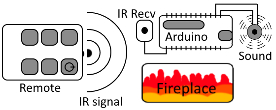
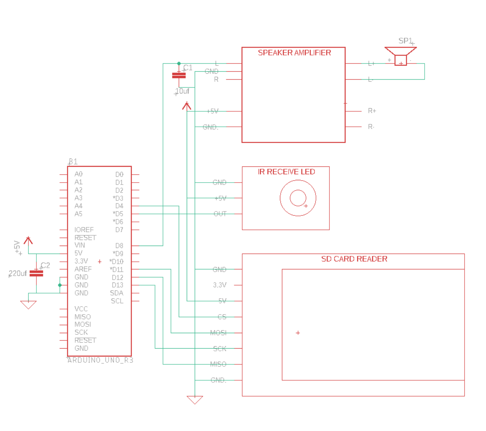

# IR Electronic Fireplace Crackle Generator

## Introduction

I have yet to encounter an electronic fireplace that produces a natural, realistic, fire crackle noise. The sound of the heater fan in a quiet room can leave you feeling quite unsatisfied. This project aims at fixing that, giving a realistic and relaxing fire crackle noise, generated by an arduinio. By utilizing your already existing fireplace remote, you can toggle both the fireplace, and sound generator, with the same push of a button!

## Prerequisites

For operation, an arduino is required with additional modules such as: SD card reader, IR receiver, speaker amplifier and a few other various components such as capacitors. Check out my youtube, [@DIY-Projects](http://youtube.com/@diy-projects) for a detailed instruction video of the process

## Methodology

Like many other short-range remote-controlled devices, electronic fireplaces mainly utilize IR remote technology which we are able to interperate on an arduino using an IR receiver. Upon pressing a button, the remote will output the signal to both, the fireplace, and the arduino. We can use this to our advantage to know when the fireplace is turned on / off. As seen in the high-level diagram below, the system will function as follows when the user turns on the fireplace:

 

Upon turning on the fireplace, the arduino will sense this signal and turn on the fire-crackle noise. Similarly, upon turning off the fireplace, the arduino will sense the signal and turn off the fire-crackle noise.  
This fire crackle noise is chosen by the user and defined as "fire.wav" in the "fireplace.ino" code, and kept on an SD card connected to the arduino as shown in the wiring diagram below:  

 

## Usage 

First, you must find a sound file you'd like to use, such as downloading one off of youtube or another website. Your sound file must be converted to a wav file with the following specifications:  
8 bit, 16000hZ, unsigned 8 bit
You can convert your sounds online on websites including, but not limited to: [this site](https://audio.online-convert.com/convert-to-wav).  
Next, you must find the IR value of your fireplace remote. To find this value, load the "IR_print.ino" file onto your arduino, then monitor the serial console as you press the buttons. You should see values appear on the screen. Copy those values, and paste them in the "fireplace.ino" script where specified.
Finally, upload the "fireplace.ino" sketch to the arduino, and try it out!